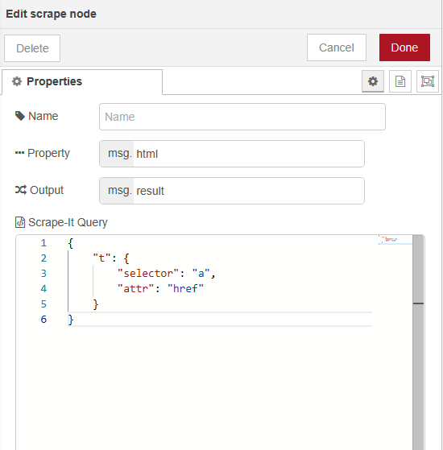

# node-red-contrib-scrape-it

A <a href="http://nodered.org" target="_new">Node-RED</a> node that implements <a href="https://github.com/IonicaBizau/scrape-it">scrape-it</a> functionality.



## Install

Use the Manage Palette option in the Node-RED Editor menu.


## Usage

A node to scrape html from a payload to JSON.

Queries are written using [Scrap-It syntax](https://github.com/IonicaBizau/scrape-it#params-1).

## Examples

```json
{
    "title": ".header h1",
    "desc": ".header h2",
    "avatar": {
        "selector": ".header img",
        "attr": "src"
    }
}
```

## Contributors

[Scott Evans][scott]

## :scroll: License

[MIT][license] © [Borja Jimeno][website]


[license]: https://github.com/borjiso/node-red-contrib-scrape-it/blob/master/LICENSE
[website]: https://borjiso.github.io/
[scott]: https://github.com/scottsweb
